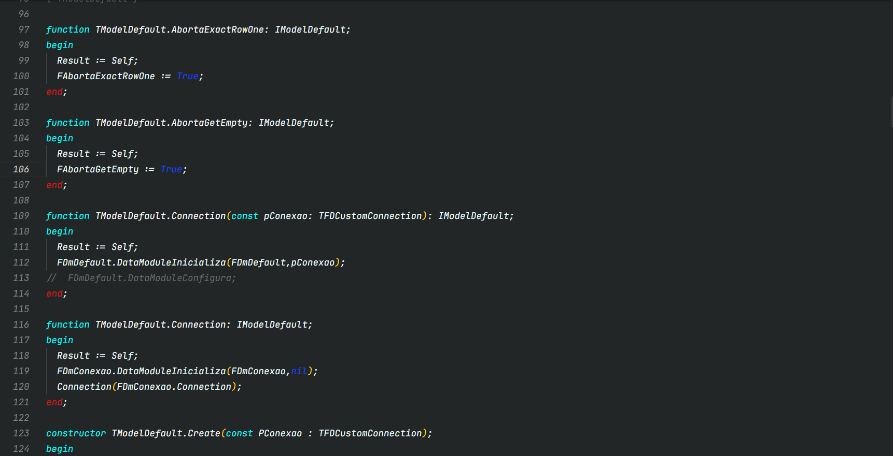

# Pizzutti Theme

This is an extension for a Visual Studio Code dark theme.
This theme was created for my great friend Pedro Pizzutti.

## Description

This theme uses low intensity colors to help those whose eyes are sensitive to bright screens.
Right now, this theme has support for most JavaScript style languages, but additional support will be added for common languages like `PLSQL (Oracle)`, `Delphi (Pascal)`, etc.

## Installation

1. Open the Extensions sidebar via `View -> Extensions` and search for `Pizzutti`.
2. Click `Install` and then click `Reload` to activate the theme.
3. Verify `Settings -> Color Theme [Command K Command T] -> Pizzutti` is set.

### Feedback
If you have any suggestions, please [open an issue](https://github.com/jr-alvs/pizzutti-theme/issues)
or a [pull request](https://github.com/jr-alvs/pizzutti-theme/pulls).